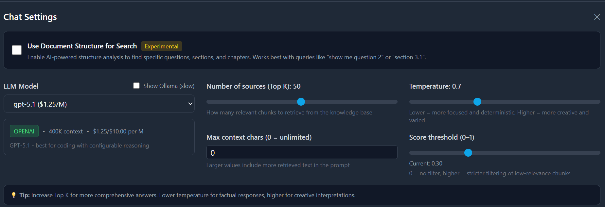

# Knowledge Base Platform


Knowledge Base Platform is a production-ready RAG backend with a clean API and a modern web UI. It ingests documents, builds a semantic index in Qdrant, and answers questions with grounded citations. It also generates document structure (TOC metadata) to enable section-aware retrieval and precise "show me question X" queries.

It can be used as a standalone service or integrated into other products via its API (plugin-style: you bring the data, it provides retrieval, citations, and answers).

## Why it is useful

- **High-signal retrieval**: Vector search with Qdrant and configurable chunking.
- **Structured navigation**: LLM-based TOC extraction enables section-aware search.
- **API-first**: Use the backend independently from the UI.
- **Provider-flexible**: OpenAI by default, with optional Anthropic, Voyage, or Ollama.
- **Grounded answers**: Responses are built from your documents, not guesses.

## Key features

- Document ingestion and chunking (txt, md)
- Embedding-based semantic search over unstructured documents
- Qdrant-backed vector index for fast similarity search
- Structured document analysis and TOC metadata
- RAG answers with citations
- FastAPI backend + React frontend
- Docker-first dev setup

## Architecture overview

- **API**: FastAPI, async SQLAlchemy
- **Vector DB**: Qdrant
- **Metadata DB**: PostgreSQL
- **Embeddings**: text embeddings for unstructured data
- **RAG**: Custom retrieval + LLM generation pipeline
- **Frontend**: Vite + React

## How it works

1) Documents are uploaded and chunked.
2) Each chunk is embedded into vectors.
3) Vectors are stored in Qdrant.
4) A query is embedded and matched by similarity.
5) The top chunks are assembled into context for the LLM.
6) The LLM returns a grounded answer with sources.
7) Optional: a TOC/structure pass enables section-aware retrieval.

## Why vectorization matters

Vectorization turns unstructured text into numeric vectors that capture meaning, not just keywords. This lets the system retrieve semantically similar chunks even when the wording differs. It is especially useful for study notes, specs, or large documents where exact keyword matches miss relevant sections.

## Retrieval and citations

The system performs **semantic retrieval**: it embeds the user query, finds the closest chunk vectors, and assembles them into a context window for the LLM. Because the answer is grounded in retrieved chunks, we can return **citations** (source snippets) alongside the response.

For structured documents, an optional **Structure‑Aware Retrieval** step builds a TOC and section metadata. This enables section‑targeted queries (e.g., “show Question 2”), returning full, verbatim excerpts rather than a generic summary.

## Quick start (Docker)

1) Create env file

```bash
cp .env.example .env
# add your OPENAI_API_KEY (or other provider keys)
```

2) Start services

```bash
docker compose -f docker-compose.dev.yml up -d
```

3) Open API docs

```text
http://localhost:8000/docs
```

## Quick start (local dev)

```bash
python3.12 -m venv venv
source venv/bin/activate
pip install -r requirements-dev.txt

docker compose -f docker-compose.dev.yml up -d db qdrant
alembic upgrade head
uvicorn app.main:app --reload --host 0.0.0.0 --port 8000
```

## Minimal API usage

- Create a knowledge base
- Upload a document
- Ask a question

API details are available in Swagger (`/docs`).

## Configuration

All configuration lives in `.env`. The sample file is `.env.example`.

Key settings:
- `OPENAI_API_KEY` (or alternate provider keys)
- `QDRANT_URL` and `DATABASE_URL`
- `OLLAMA_BASE_URL` (optional for local models)
- `MAX_CONTEXT_CHARS` (0 = unlimited)

## Chat settings (UI)

The chat UI exposes retrieval controls to tune answer quality:

- **Top K**: number of chunks retrieved from the vector store. Typical range 10–50. Higher values add recall but can bring more noise.
- **Max context chars**: limit for assembled context (0 = unlimited). Lower values reduce cost/latency; higher values preserve more context.
- **Score threshold**: minimum similarity score (0–1) to filter low‑relevance chunks. 0 disables filtering; 0.2–0.4 is a good starting range.
- **Temperature**: response randomness. Use 0–0.3 for factual extraction, higher for exploratory/creative explanations.
- **Use Document Structure**: enables TOC‑aware, section‑targeted retrieval (e.g., “show question 2”).



## Repo layout (minimal)

```
app/           # Backend
frontend/      # UI
docker/        # Docker assets
```

## Status

This project is actively used and evolving. If you want to adapt it to a new domain or provider, the API layer and retrieval engine are designed to be modular.
